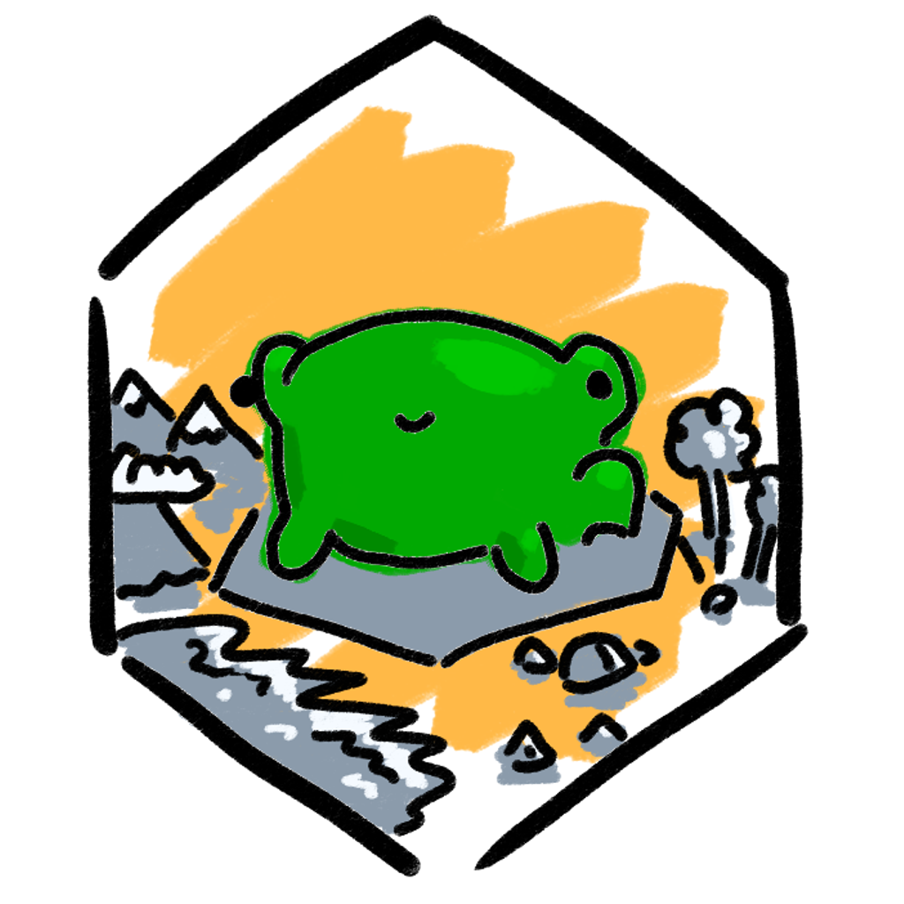

# Hexaworld

A small raylib-powered c program that will generate an hexagonally-tiled world through successive application of cellular automatons.

***



> *oh no, what it gonna do ?*
***

## Compiling

This for linux.

### Prerequisites

Having `raylib` installed on the system as a static library.
> *Link* : [Raylib on GNU/Linux](https://github.com/raysan5/raylib/wiki/Working-on-GNU-Linux)

Having `gcc` and `make` installed on the system.

### Command

Position yourself at the project's root and type :

```bash
$ make
```

... to compile the project. This will create a `build` directory (not very interesting) and a `bin` directory (mucho more interesting).

### Result

You will find the binary executable (`otomaton`) in the bin directory :

```
.
+-- bin
|   +-- otomaton
+-- build
|   +-- ...
+-- img
|   +-- ...
+-- inc
|   +-- ...
+-- src
|   +-- ...
+-- Makefile
+-- Readme.md

```

## Usage

Execute the program :
```bash
$ ./bin/otomaton
```

You can navigate the layers with the left and right arrows. You also can re-generate the map with left shift + enter.

The program also accepts some options :

- `-s seed` with `seed` as any integer. The program will use this to seed the RNG ;
- `-x width` with `width` as a non-zero unsigned integer. This will set the horizontal number of tiles ;
- `-y height` with `height` as a non-zero unsigned integer. This will set the vertical number of tiles.

Some keybinds are also available :

- `shift + enter` to generate a new world ;
- `left` or `right` to check out the generated layers ;
- click on any cells to see some information about it.

# WIP

Here is my rough roadmap :

- `[x]` base system for layers
- `[x]` tectonic plates layer
- `[x]` landmass layer
- `[x]` altitude layer
- `[x]` wind direction layer
- `[x]` ~~humidity~~ cloud cover layer
- `[x]` freshwater & rivers layer
- `[x]` (bonus !) temperature layer
- `[x]` vegetation layer
- `[x]` overall drawing cellular automaton function
- `[x]` basic UI to give info on the tiles
- `[ ]` tweaks to layers generation to make it as good as I can
- `[ ]` sprite "stickers" proceduraly added on certain tiles for looks
- `[ ]` PNG export
